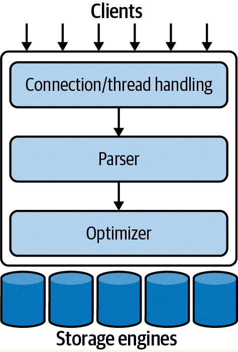

# High Performance MySQL - 4ed notes

DISCLAIMER: These notes below are not designed to be 1:1 copy of the book. I did not create them in order for other
people to skip reading the book - it's more a remind-me summary, to have a general overview of what's possible in
MySQL, and what is not. Therefore, I tend to skip parts of the book, just writing what is in the specific part,
leaving exact notes/SQL commands/etc. to be checked in the book when needed.

What is more - I'm a programmer, that sometimes has to dabble in architecture or apps migrations. My interests in
this book were purely to know that something is, or is not - possible, and to have some common language with SREs,
DB admins and such. So notes may be skipping stuff that I'm not interested in. When that occurs - there's a direct
mention of that.


## Chapter 1 - MySQL architecture

In general architecture of MySQL is simple - and the image below presents it:



Below you can find 'obvious' things about RDBMs. The authors are gathering all the high-level information about
RDBMs, to get some common ground when discussing stuff later.

* by default every connection to the MySQL DB is handled by a separate thread (resolving to CPU thread).
* security is handled usually through user/host/pass, but also X.509 certs can be used - every query is evaluated,
  as users can be granted access rights for executing specific query only
* optimizer creates a **query tree**, and tweaks it to serve the query the best. It does not care about storage
  engine, but uses its metadata and config to figure out the best way of execution.
* MySQL of course applies *read locks* and *write locks* - typically on the *row level* (implemented in the
  **storage engine**, not in server), but sometimes on the *table level* (with optimisations to limit it as much as possible)
  when that's necessary. However, more on that in the later chapters.
* **transaction** is an atomic unit of work - typically a couple of SQL commands grouped together. *Relational
  databases* usually support **ACID** transactions - below some cheatsheet for remembering:
    * **atomicity** - transaction is either applied 100% or not at all. There is no in-between situation.
    * **consistency** - there is no way that the DB is left in the inconsistent state once the transaction has been
      committed.
    * **isolation** - by default transaction in progress is not visible to other transactions/commands. However, that
      can be changed
    * **durability** - once committed, transaction results should be stored and safe. However, that concept is very
      wide one, as we got different layers of durability.
* **isolation levels** were mentioned a little when discussing letter 'I' in the ACID. The concept is wide, as we
  got defaults recommended by ANSI SQL standard, and also specific things related to MySQL. The book suggests to
  start with to separate links - [critique of ANSI SQL isolation levels](https://blog.acolyer.org/2016/02/24/a-critique-of-ansi-sql-isolation-levels/) and [an overview of consistency models](https://jepsen.io/consistency) - in the last one you can click on every square to get into more detailed description.

  Types of the isolations are as follows:
    * *READ UNCOMMITTED* - the most problematic ones - other transactions can see specific transaction changes as it
      progresses. Rarely used.
    * *READ COMMITTED* - as the authors say - default level of most of the RDBMs, **but not MySQL**! In this type of
      isolation the transaction can see changes of the transactions that were committed after it started.
    * *REPEATABLE READ* - this it the **default level in MySQL!** In general the transaction won't see changes in the
      data set it was reading during execution. I recommend this [StackOverflow question](https://stackoverflowcom/questions/4034976/difference-between-read-commited-and-repeatable-read-in-sql-server)
      to get more gist of what's being discussed here, and also learn what *phantom read* is.
    * *SERIALIZABLE* - is the strictest isolation level, and usually not used. It ensures that transaction during its
      execution time will always operate on the same data set, without other transactions changing the data.

* **deadlock** is another term, that should be already familiar - in the context of RDBMs what is most important,
  that typically there is no way to step out of the **deadlock** without rollbacking one of the transactions
  involved in a **deadlock**. Storage engines can handle them differently, but the thing to remember for the time
  being, is that there are mechanisms at play that are actively monitoring the server searching for, and resolving
  **deadlocks**.

* it's possible to modify *AUTOCOMMIT* setting, which is responsible for automatically committing or rollbacking the
  queries being sent to the DB, even if they don't have explicit *BEGIN TRANSACTION* statement.
* as mentioned before MySQL implements transactions at the **storage engine** level, so it's impossible to rely on
  them when different engines are mixed in one transaction.
* MySQL supports non-standard locking of rows for specific operations, eg. *SELECT .. FOR SHARE* or *SELECT .. FOR
  UPDATE*. It also supports *(UN)LOCK TABLE(S)*, implemented in the server, but as default InnoDB storage engine
  uses more fine-grained row locking (but check out next point), usually using table locking is not needed.
* InnoDB storage engine not only uses row-level locking, but in order to speed things up, it adds something called
  *Multiversion Concurrency Control MVVC*. Every storage engine implements it differently, and it can perform
  multiple operations based on the context in order to limit actual locking to the minimum. The book provides an
  example for InnoDB using **redo log**.


## Chapter 2 - Monitoring in a Reliability Engineering World

This chapter is very generic in terms, and not that much informative to my taste. Discusses SLA/SLI/SLOs and specific
measurements we can use for them.


## Chapter 3 - Performance schema

This chapter is about using *performance schema* (and its companion - *sys*) to gather information whether the changes we've introduced
to the MySQL, are affecting performance in the way we've expected. Two main things authors explain at the beginning are:
* **instrument** - is a portion of MySQL code we want to capture info about
* **consumer** - this is the table that stores gathered data about **instrument**

In the *performance schema* we got a table called *setup_instruments*, that contains a list of all the **instruments** that can
be used as such. Examples are **statement/sql/select** or **wait/synch/mutex/innodb/autoinc_mutex** so you get the gist of how that's being
named and operated. We can use **description** column in this table to get more info  (although it is NULL for many of them).

**Consumer** is a table which is used to store data about the **instruments** - in version MySQL 8.0.25 as authors claim,
there is 125 tables in the *performance schema*. Their names are usually self-explanatory. To finish the concept here - **consumers**
obviously need memory to operate, and they start using that memory as soon as the specific **instrument** is being enabled.
However, after it is disabled, **the memory allocated by them is not freed!** As long as you don't restart the server - you're doomed ;)

Since version 5.7 MySQL also contains companion schema for *performance schema*, and it's called **sys**. It contains views and
stored procedures, that ease getting data from *performance schema*. However, this schema does not contain all the possible
data/views, so if something is missing in **sys**, just try to check for the data existence exactly in **performance schema**.

Before we proceed further to explain configuration and usage of **performance schema** in more detail, we have to explain the
threading naming and architecture in MySQL. In general, the database operates as a multithreading application. Every thread
has its own unique identifiers - one that is OS kernel thread ID, and also the **internal MySQL thread ID**, which is
called **THREAD_ID** in all the **performance schema** tables. Also, every foreground process has its **PROCESSLIST_ID**, that
identifies every connection to the DB. Table **threads* in **performance schema** contains all the threads currently working
in the DB.

### Performance schema configuration

In general there are only a couple of settings that cannot be changed dynamically during server operation. That mostly
includes setting *performance_schema* value to ON/OFF in the config file or CLI. Same applies to memory usage settings.
**Instruments** can be enabled or disabled by direct update via SQL of the  *setup_instruments* table, or using
procedures from **sys** schema (*ps_setup_enable_instrument* and *ps_setup_disable_instrument*). These operations
do not persist between restarts. If you want to have it preserved - use variable *performance-schema-instrument*
with a list passed of instrument name and setting for it (0, 1, ON, OFF or variations for COUNTED/TIMED).

In a very similar manner you can enable/disable **consumers** - only names of the tables/procedure/variable changes
to **consumer**. Names of the **consumers** (there is 15 of them as authors claim) are usually self-explanatory -
however, they provide a table with names and descriptions for those not that obvious ones (table 3.1).

Table **setup_objects** is used to enable/disable *performance schema* for a specific objects in a DB - like
events/functions/tables/etc (for a specific DB level) - simple SQL insert statement to this table will allow you to
fine-tune the performance gathering behaviour. Changes in the table are **not persisted between restarts**.

Table named **setup_threads** configures a list of background threads that should be monitored. Pay attention -
we're talking about **server threads**, not user-related threads (for them there's another table - **setup_actors**).
As with all the above changes - they do not persist between restarts.

In general **performance schema** keeps data in memory (hence not persistence behaviour for data in the tables) - in
order to tweak memory settings for it, we have to use specific config variables. Direct quote will be best here:

> Names of the variables follow the pattern **performance_schema_object_[size|instances|classes|length|handles]**,
> where the object is either a consumer, a setup table, or an instrumented instance of the specific event. For
> example, the configuration variable **performance_schema_events_stages_history_size** defines the number of stages
> per thread that the **performance_schema_events_stages_history** table will store. The variable
> **performance_schema_max_memory_classes** defines the maximum number of memory instruments that could be used.

To finish configuration part - typically every MySQL version has changes in the default options for **performance
schema**. It is advised to always check the documentation for the specific version you're using.


### Usages of performance schema

Subchapter contains the following typical use cases for the **performance schema**:
* examining SQL statements
* examining read vs write performance
* examining metadata locks
* examining memory usage
* examining variables
* examining most frequent errors
* examining performance schema itself


## Chapter 4 - Operating system and hardware optimization

Notes here aren't in any way robust, as I've never (and potentially never will) take part in choosing the hardware
for a production-grade MySQL instance, however here are some bullet points to remember:
* if you want low latency - **single powerful CPU should be priority**, however if the most important part is
  throughput - you will benefit from **multiple CPUs serving the traffic**.
  *DNS resolving can add up to delay in handling traffic. You may consider setting that to FALSE, and operate only on
  IP addresses for communication and config.
  *SSDs are a life-saver, and the cost of hitting the disc dropped significantly due to that. Still, you may prefer
  to have quite a lot of RAM, in order to have big, warmed-up caches that will limit the necessity of disk usage to
  the minimum (with structured writes done once in a while, and not applying all the changes separately). For
  servers, it is a general good practice to set swapping values to 0 - reducing the trouble.
* filesystem type is not that important - although it's preferred to choose *journaling filesystems* in order to
  speed up checks and recovery after failure.


## Chapter 5 - Optimizing server settings

In general this chapter is rich in content - obviously it would be stupid to list all the potential config variables
here, as I would need to rewrite a book. My notes here are mostly just for remembering what's possible to achieve
via configuration of the server.

### Configuration variables setting and persisting

For starters let's rewind to the already mentioned concept of settings - we can provide them via command line when
starting the process, or using MySQL config file, that on UNIX-like systems resides typically in */etc/my.cnf* or
*/etc/mysql/my.cnf* files (depending on the system). The way to check that is to issue below commands that authors
suggest:

```bash
$ which mysqld
/usr/sbin/mysqld

$ /usr/sbin/mysqld --verbose --help | grep -A 1 'Default options'

Default options are read from the following files in the given order:
/etc/mysql/my.cnf ~/.my.cnf /usr/etc/my.cnf
```

Most of the options has a **global scope** (treated as default), but can be changed for a specific user session.
What is important is to remember, that changing global settings dynamically (while the server is running), does not
change existing connections/sessions (which is important if you rely on pooling in your app). There's also a way to
set the variables for the specific using default from the global scope (which can be useful for reverting to
defaults once we've changed something for the specific session use case):

```
// Samples taken from the official MySQL docs for version 8.0
// Below statements are equal in result

SET @@SESSION.max_join_size = DEFAULT;
SET @@SESSION.max_join_size = @@GLOBAL.max_join_size;
```

It's worth remembering that whatever you change dynamically during the server runtime, it may not get persisted -
even if you use *SET GLOBAL* construction. However, starting from version **8.0**, MySQL offers **persisted
variables**, that actually allows to set variable with one command for the specific runtime, and at the same time to
persist it in the config file. You may have guessed that the syntax for it is **SET PERSIST name = value** ;)

What is more - authors warn that sometimes the name of the variable, does not clearly indicate how the change to it
(dynamic change) will work - right away, after some time, for new objects/instances created/etc. It's always advised
to check the docs.

**DISCLAIMER FROM AUTHORS** - usually trying to 'tune' the server (using predefined scripts, some ratio formulas
found around) is huge waste of time. Every app/config/hardware/load is different, and it behaves differently during
the day or week. Usually when it comes to settings of the server, it's way faster and easier to tweak indexes/schema
performance rather than the server itself. You've been warned.


### Creating MySQL config file

Authors of the book set up a minimal config file, that is described in the book:

```
[mysqld]
# GENERAL
datadir                                  = /var/lib/mysql
socket                                   = /var/lib/mysql/mysql.sock
pid_file                                 = /var/lib/mysql/mysql.pid
user                                     = mysql
port                                     = 3306
# INNODB - Check out MySQL 8.0 innodb_dedicated_server setting!
innodb_buffer_pool_size                  = <value>
innodb_log_file_size                     = <value>
innodb_file_per_table                    = 1
innodb_flush_method                      = O_DIRECT
# LOGGING
log_error                                = /var/lib/mysql/mysql-error.log
log_slow_queries                         = /var/lib/mysql/mysql-slow.log
# OTHER
tmp_table_size                           = 32M
max_heap_table_size                      = 32M
max_connections                          = <value>
thread_cache_size                        = <value>
table_open_cache                         = <value>
open_files_limit                         = 65535     # as much as possible
[client]
socket                                   = /var/lib/mysql/mysql.sock
port                                     = 3306
```

I'm putting it here, but not going to describe every setting. It's only here as a starting point, and a reminder for
myself (and I expect the readers to follow me). If you want to have a more detailed description - get your book.


### Configuring memory usage

Below are just bullet points of what to take under consideration. More in the book:
* small amount of memory for every connection
* OS that runs MySQL also needs some memory to work in general, and potentially run something other than MySQL. Not
  talking about machines with MySQL, Apache and Docker, but core-OS things (like monitoring tools and such). In
  general as long as OS does not swap, you're fine.
* **InnoDB Buffer pool** is one of the most important (holds indexes, sometimes data, locks, and a lot of other stuff).
  This [StackOverflow question](https://dba.stackexchange.com/questions/27328/how-large-should-be-mysql-innodb-buffer-pool-size) seems like a good place to start. Also
  remember that in case of a restart, there are options to flush the buffer to disc, and read it upon startup. That
  prevents caches from being cold right after the server start.
* There is also **thread cache**, which holds free threads that can be used to serve connections. Once new
  connection is made, the thread is taken from **thread cache**. Defaults should be fine for 99% use-cases.


### Configuring MySQL I/O

The whole subchapter is dedicated to InnoDB, and the topics are listed below:
* **InnoDB Transaction Log** - in order to save the amount of possible I/O operations in order to persist data -
  MySQL keeps the log of transactions, and therefore making writes to the disc to be sequential, instead of random
  (with a background thread).
* **Log buffer** - used to keep in memory to reduce (surprise, surprise) the amount of I/O operations. Default
  should be sufficient. **Read the specific subchapter here to understand the difference between log writing and
  flushing!!!**
* **InnoDB Tablespace** - it is a-kind-of virtual filesystem, that MySQL uses for a lot of different things. It is
  VERY unforgiving about its locations/sizes - so tread carefully here. Especially with **undo log**, when a lot of
  transactions are executed in REPEATABLE READ (which is a default).


### Other settings

Things like concurrency limits, safety (max connections, max connections errors and such - IMPORTANT), and advanced
InnoDB settings.


## Chapter 6 - Schema design and management

### Choosing optimal data types

Use data types for columns wisely. Here are some rules of a thumb:
* smaller is usually better
* use dedicated types for specific data, don't try to bypass stuff
* avoid NULL if possible

It's worth remembering - especially in the situations that are common, like using H2, MySQL or Oracle interchangeably -
that MySQL provides aliases for specific types. E.g. BOOL is an alias for TINYINT. What is more - specifying the size of the decimal value, e.g. INT(11) does
nothing to the total size or logic for the column - it's just a hint for the command line tools to display them
differently.

In case of character-based types - how they are actually implemented is very storage engine depending. For InnoDB,
**VARCHAR** needs additional byte (for strings < 255 chars) or two (for bigger ones) to store the value length.
**CHAR** obviously always uses the same amount of memory/disc, which actually is not a bad thing, especially for
predefined, or short values. It can speed up the computations and avoid fragmentation. In addition - **VARBINARY**
and **BINARY** types exist, to store bytes. It has its own padding/trailing logic (so check the book) - but if you
need to store raw bytes that type of data can be of great help (especially in terms od performance).

For holding larger values of text, we got **TEXT** and **BLOB** family (with size subtypes). In general in the rows
they store just identifier data, and the data per-se is stored elsewhere (depending on the engine). There are rules
for sorting/searching this data - read the book.

For time, we got two - **DATETIME** (wide range, 8 bytes) and **TIMESTAMP** (smaller, 4 bytes, Unix-timestamp up
until year 2038).

There are also types for bit-like operations - **BIT** and **SET**, but I've never had a requirement to store bits in
the DB. The logic for their retrieval and storage is weird - read the book.

To finish the subject of data types - there is also a type for holding JSON values. Authors provide some sample
comparison of performance of accessing JSON fields in a table directly vs converted values into the table. In short
- when it comes to pure DB performance - using tables with separate columns is better.


### Schema design gotchas

* too many columns/joins
* use ENUMs wisely (and use SET when possible)
* NULLs are not that bad as is may seem - if you need it - use it. It is better than magic constants or some bogus
  defaults


### Schema management

Describes good practices about managing schema - CI/CD, scripts, etc. To me, these are quite obvious things, and
using tools like Liquibase is not a rocket science.


## Chapter 7 - Indexing for performance

### Indexing basics

There are two main types of indexes:
* **b-tree indexes** - nothing new, except the fact that InnoDB can create **adaptive hash index** if it sees that
  specific records are accessed very frequently. It will store them in memory to speed things even more. General
  rule of a thumb is to use index leftmost column for searching.
* **full-text indexes**


### Indexing strategies for high performance

* prefix indexes and index selectivity - in order to save some memory you can make an index using only a couple of
  first characters in a column, instead of the full value. Read the book for SQL queries samples.
* multicolumn indexes - boldly indexing all the columns (typically the ones that appear in the WHERE clause) or
  creating an index with a lot of columns is just wrong. Samples in the book, but as a takeaway - seeing **INDEX
  MERGE** in the **EXPLAIN** clause means that you have something wrong. With the multicolumn indexes (and it was
  mentioned before), the most important thing is the leftmost column. In the *b-tree indexes* they're being used
  first in search/sorting. So based on the queries - choose the column wisely (you can read more in the book about
  **cardinality** and **selectivity**).
* clustered indexes - the concept is widely described in a book, but just to remind (based on InnoDB) - this kind of
  index (it is not  recognized as a separate type per se) allows to put rows values in the index leaf-nodes. Simply
  put - that allows us to very quickly and easily fetch all the data related to specific index range. As an example
  authors use mailbox app, where all the single user messages are located very close to each other, but there are
  also caveats (read the book, as the list is long).
* covering indexes - this type of indexes are present only in *b-tree indexes*. In general indexes are used to
  **find** rows quickly (that's what everyone thinks). However, they can be also used to fetch the actual data -
  especially if the query that is using the index, wants only the data that the indexes covers (InnoDB is even
  smarter here). The index that was created with that approach in mind is called **covering index**. When you use **EXPLAIN** and see *USING INDEX* in
  the *Extra* column - then you're using **covering index**.
* using index scans for sorts - read the book for samples
* redundant and duplicated indexes - it's possible to create a duplicate index (meaning the same columns in the same
  order), and MySQL will only give you a warning. They're not in any way useful and should be removed on the spot.
  Removing them, however, can get tricky - read the book for more info.
* unused indexes - don't think, remove.


### Index and table maintenance

* finding and repairing table corruption - *CHECK TABLE*, *REPAIR TABLE*
* updating index statistics - index statistics are used by the optimizer to calculate the overall cost of the query.
  When the statistics are stale or were never generated then issuing *ANALYZE TABLE* can fix that. The overall
  explanation of the concept is in the book.
* reducing index and data fragmentation - *b-trees* leaf nodes can get fragmented - fix that with *OPTIMIZE TABLE*


## Chapter 8 - Query performance optimization


### Basics of more performant queries

In general, when we see that some queries are running slower than expected - typically we may ask two questions - isn't
the fetched amount of rows too big, or maybe the amount of columns fetched should be reduced? The latter can be mitigated with
caching and limiting the columns being fetched, the former with informed indexing which limits the total amount of rows
that must be searched.

We can also try to break problematic query into a couple of smaller ones. It's not working every time, however, it is
worth keeping that possibility in mind. Another solution may be chopping the query, by reducing the total amount of
affected rows - example provided by the authors is removing rows from the table using *LIMIT* clause in a loop, instead
of removing all the necessary rows at once.

The last simple technique to follow is to actually remove *JOINs* between table, and execute a couple of separate
queries, and merging the result set in the application. This may look wasteful, but with proper app-based caching, better
multiple-instances clusters localisations and shorter lock times, this may be beneficial in some use cases.


### Query execution basics

In general the MySQL connection protocol is *half-duplex* - it can either retrieve data or send them - can't do
both at the same time. Once asked for an answer, the client must wait for the server to respond with all the response. There
is just no way for cutting that in half. By default, clients are fetching all the data from the server, and buffer it in
the memory. Usually there is a way to configure that (there are samples in the book).

After the query gets to the server, an **optimizer** kicks in. Its job is to create an **execution plan** of the query. The
steps along the way are:
* **parsing** - building a parsing tree, finding syntax error and such.
* **preprocessing** - continues the work of the parser, but on higher level - checking if tables used in the query
  exists/privilages needed for the execution/etc.
* **optimizer** - the main speed-up process - optimizing. Optimizer tests different execution plans and chooses one
  with the lowest cost. The topic is of course quite complicated, and not covered in a book, however you may find
  ways how to check the actual query cost in the book + there's a lot about potential **static/dynamic** query
  optimisations possibilities. The result of the optimizer work is technically the less costly **execution plan**,
  that is later handled to the storage engine to execute.

Optimizations in general are very broad topic, and instead of rewriting a book I will just point out that you may find **join optimizations** - and for MySQL join is not just a join between two tables and sort optimizations described in a great detail.

### Limitations of the query optimizer

* UNIONs aren't handled that great - if possible, check if you cna separate the query
* avoid using big *IN()* lists
* there's no parallel execution of the queries
* you can't at the same time select and update the same table - you must use inner join to achieve that


### Optimizing specific types of queries

* always use *COUNT(\*)* if you want to get a total number of returned rows. That's a special expression, not being
  evaluated to the column list.
* *JOINS* benefit tremendously from the indexes on the second table in the join. Here also is advised to use for
  grouping or sorting only columns from one table, so an index can be used
* *LIMIT* and *OFFSET* can be improved too - using inner joins and covering index to get the additional data that
  the app needs. Check the sample in the book. DOn't forget the *SQL_CALC_FOUND_ROWS* hint.
* it was mentioned before - always use *UNION ALL* in unions, to avoid default appliance of distinct to every query
  consisting of UNION.


## Chapter 9 - Replication

Ok, so now we have a change in wording, and instead of MASTER/SLAVE we got SOURCE/REPLICA. Replication is generally
backwards-compatible, but not the other way around - older servers may not that great work as a replica, for newer
source.

### Replication under the hood

Data to be replicated are kept in the **binary log** in the source server. There are three strategies when it comes
to formatting this log (controlled by *binary_log_format* config param):
* statement-based
* row-based  - this is recommended one, as it ensures data consistency, despite the additional memory usage
* mixed

Replication is not only about speed - it's mostly about data consistency too. What's the point of 10 different
replicas serving traffic, if every one of them has completely different data than the source does. That is important,
especially when the source crashes, and the **binary log** gets recovered from the backup. It was a tedious task,
and therefore since MySQL 5.6 a **GTID** was introduced, which stands for **Global Transaction ID** - it combines
server uuid and transaction number. Now, when we recover, there's no problem with identifying the transactions that
were actually replicated/applied by the replicas. Actual sample in the book + additional settings that can be used
to ensure data consistency between source and the replica.

Replicas can be configured to not only use one thread for reading **binary log** of the source, but can do that in a
multithreaded way. There are two types there - **DATABASE** which will apply multiple threads to handle writes to
different DBs, or **LOGICAL_CLOCK**, which is more robust, and operates on the source's **binary log group commit**.
More in the book.

There is also **semi-synchronous lock** - where source waits, until at least one replica acknowledges it got the
transaction from it. If the timeout occurs - the source reverts back to the default *async* way.

It is also possible, to limit the replication process by applying **replication filters** - either on the **source
binary log** or on the **replica relay log**. That may sound interesting, unfortunately, these mechanisms do not
work as expected. Read the book to get more details.


### Replication failover

This is the process when one of the replicas is being promoted to be a source. It is either planned (due to
maintenance), or it is a result of some crash. The steps how to perform that are in the book.


### Replication topologies

MySQL gives you a lot of possibilities when it comes to replication config, therefore authors say one thing - don't
try to be smart. Below are two topologies that due to them, cover 99% of use-cases.

* active/passive - is simple as hell - there's one source that handles both read and write operations, and a couple
  of passive replicas, that do not serve any traffic. It's for the security of the data - no delays in replication
  take place. Servers should have the same hardware and config, so potential switching from source to replicas,
  should be no problems. For a lot of apps that will do fine - as long as you don't hit the performance capabilities
  of the source server. In that case - sharding or change the model to the below one.
* active/read pool - 'classic approach' we may say. The source holds all the writes, and the reads are evenly
  distributed between replicas, but it's also possible to use source for that. Hardware and configs should be the
  same, for the sake of simplicity when we need to switch from source to other server.

Authors also describe discouraged topologies - I won't be listing them here for obvious reasons - read the book if
you're interested.

The rest of the chapter is dedicated to the monitoring of the replication, and ensuring it works as expected. As it is
nowhere near my interests, and potential responsibilities I'm skipping it. If interested - read the book.


## Chapter 10 - Backup and recovery

I'm not making notes on that because I won't be ever doing these things, so it's of no interest to me.


## Chapter 11 - Scaling MySQL

We must start with the concept of **read-bound** and **write-bound** workloads - which specify for which operations
we would like to actually scale our database. There were samples in chapter 3 that can help with figuring out which
is dominant in your use case. Without figuring out which type of workloads you're facing - there's no way of
applying a proper solution.

### Functional sharding

I'm surprised that in the book related to DB, the authors actually suggested, that the data in the DB should be
separated using functional/logical coherence of the data in the tables. Something that recently came with
DDD/microservices, seems to also find its way to the DB world. Nice.

### Scaling reads with read pools

Nothing original here - we use replicas to handle read traffic, while source handles only writes. The subchapter
gives more specific details (load balancing, health checks, config management) but from overall perspective the
main concept is just to keep a separate pool of replicas for reads. That's it.

### Optimising writes - queuing and sharding

First way of improving writes, is the concept of **queuing**, which is a way to increase performance of
writes. Instead of direct, synchronous calls to the source, and waiting for the request being fully processed, we
can just introduce a middle layer in the form of the queue - whether it's Kafka or any other messaging/event store
mechanism.

When it comes to **sharding**, authors describe two mechanisms for that:
* **functional partitioning** - where you simply put specific DBs/schemas/tables in the separate nodes, based on their
  functionality. So your registration tables, are not affected by the spike in commenting section.
* **data sharding** - does not take functional stuff under consideration, instead if just divides data into smaller
  chunks and distributes them among different nodes (called, surprise, surprise - **shards**).

So how do we introduce sharding? The most crucial thing is to partition the data in a way, that its retrieval does
not require reading it from 10 different shards (obviously). It's the same situation as with memory pages, and
eventual reading of data from the hard disc. In general - the best **partitioning key** used is the one, that
simulates typical reading operation. The authors use as an example a table, that holds blog posts. Sharding by
primary key of the post ID is not that effective, because usually we want to fetch a blog post of the specific user.
Therefore, in order to find that data, we have to revisit many shards.

The rest of the chapter describes two popular solutions for sharding in MySQL - **Vitess** and **ProxySQL**.


## Chapter 12 - MySQL in the cloud

Overall description of the MySQL offerings by different cloud providers. Nothing that in-depth, and as the matter is
highly changeable I'm not putting anything here as notes.


## Chapter 13 - MySQL compliance

Same situation like in the previous chapter - something that I won't be ever touching in my regular life, so no
making notes.

